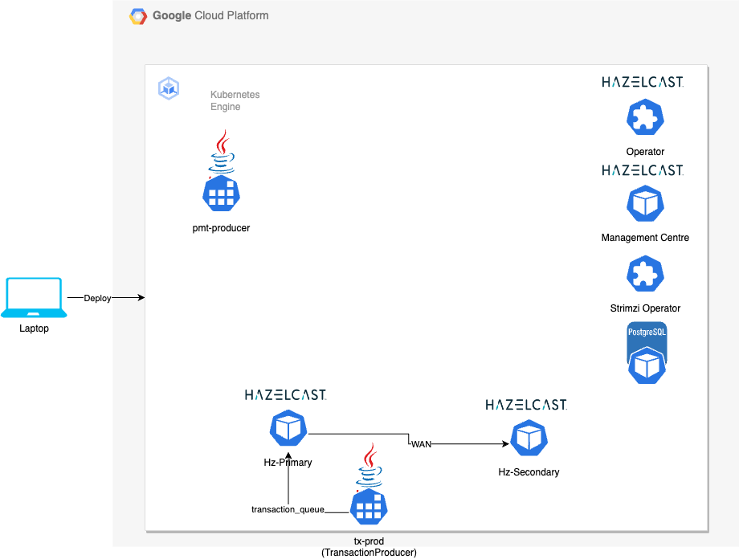

# A Hazelcast Streaming Payments Demo
The idea is to process streaming payment messages using Hazelcast Platform. Payment messages are generated by a 
java project called `pmt-producer` and are sent to a Kafka topic `payments`. A java project called `pmt-job`
is deployed as a Hazelcast pipeline to consume the messages from the Kafka topic and process them. 

The functional goal is to display a dashboard which gets updated in real-time with the liquidity position of each bank. Payment messages are simple JSON that debits a bank and credits another. The Hazelcast Jet job processes the messages and updates the liquidity position of each bank. The dashboard is a simple web page that displays the liquidity position of each bank. The dashboard is updated in real-time as the payments are processed.

The demo is deployed on GKE using Ansible. Follow the pre-requisites and steps below to deploy the demo.

The demo can also be run on a local machine using Docker Compose. 

## GKE
### Pre-requisites
1. [Service Account](https://developers.google.com/identity/protocols/oauth2/service-account#creatinganaccount) with 
permissions to create GKE. The service account must be downloaded as a JSON file and located in `~/.gcp/credentials.json`
2. Ansible installed in local machine. Used to orchastrate the deployment.
3. kubectl installed in local machine. Used to interact with the GKE cluster.
4. Helm installed in local machine. Used to install Kafka and Hazelcast.
5. [Hazelcast CLC](https://docs.hazelcast.com/clc/latest/install-clc) installed in local machine. Used to deploy jobs to the Hazelcast Platform.
6. Maven installed in local machine.
7. [Skaffold](https://skaffold.dev/) installed in local machine. This is optional but is needed for local development.
7. Hazelcast License key present in file `~/hazelcast/hazelcast.license` in local machine. 
8. Google Auth plugin installed pip - `pip3 install google-auth` in local machine
9. Install `gloud` via `brew install google-cloud-sdk` and `gke-gcloud-auth-plugin` via `gcloud components install gke-gcloud-auth-plugin` in local machine
10. A repository in [GCP Artifact Registry](https://cloud.google.com/artifact-registry/docs/docker/store-docker-container-images#linux) with 
name mapping to variable `repository_id` in region `asia-south1`. Ansible will push the docker image to this repository. Various parameters can be modified via the var files. 

### Steps
In general the ansible playbook, `deploy.yaml` does the following:
1. Creates a GKE cluster including VPC, subnets and nodes. See `gke` role.
1. Creates a Postgres database. See `postgres` role.
1. Creates a Kafka cluster and topic along with Prometheus. See `kafka` role.
1. Create self-signed certificates for Hazelcast. See `hz` role.
1. Creates two Hazelcast clusters with WAN replication and a Management Center. TLS is enabled. See `hz` role.
1. Creates a Hazelcast streaming job. See `pmt-job` role.

1. Start Docker on the laptop and execute `ansible-playbook k8s/deploy.yaml`.
2. You can run individual tasks by using `tags`.
For example, following commands will create the GKE cluster, populate the database, configure ssl certificates, deploy Hazelcast clusters and start Management Center.
The next command will deploy the pipeline and the next one starts producing the transactions.
    1. `ansible-playbook k8s/deploy.yaml --tags="gke,init,postgres,ssl,hz-init,hz"`
    2. `ansible-playbook k8s/deploy.yaml --tags="pipeline"`
    3. `ansible-playbook k8s/deploy.yaml --tags="tx-prod"` 
3. You may check the cluster on MC on `http://<EXTERNAL-IP>:8080` where `EXTERNAL-IP` is the external IP of the service `hazelcast-mc` service. Run `kubectl get svc` to get the IP.
4. To shutdown the cluster execute `ansible-playbook k8s/undeploy.yaml`

### Undo
1. To delete kafka execute `ansible-playbook k8s/undeploy.yaml --tags="kafka"`
### Architecture
_Work in progress_

## Docker Compose

### Pre-requisites
1. Local Docker
1. Local Maven
1. Hazelcast [CLC](https://docs.hazelcast.com/clc/latest/install-clc)
1. Open file `pmt-producer/pom.xml` and uncomment the `platform` tag appropriate to your laptop (mac or linux). For GKE deployment, both platforms are built. See [this](https://github.com/GoogleContainerTools/jib/blob/master/docs/faq.md#how-do-i-specify-a-platform-in-the-manifest-list-or-oci-index-of-a-base-image)

### Steps
1. Compile the java projects and run docker compose as `mvn install jib:dockerBuild -Dimage=pmt-producer && docker-compose up -d`. See [this](https://stackoverflow.com/questions/61968213/can-jib-be-used-without-a-repository) and [this](https://stackoverflow.com/questions/60862687/how-to-create-docker-compose-yml-file-while-using-jib).
1. You can view the deployment on Hazelcast Management Centre on `http://localhost:8080` and adding the server with name `dev` and address `hz`.
1. As a one time step you have to add local docker config for Hazelcast CLC using `clc config add docker cluster.address=localhost:5701 cluster.name=dev`
1. Deploy [data connection](https://docs.hazelcast.com/hazelcast/5.3/data-connections/data-connections-configuration) to the kafka service using `clc -c docker script ./k8s/roles/pmt-job/files/kafka-ds-docker.sql`.
1. Deploy the job as `clc -c docker job submit ./pmt-job/target/pmt-job-1.0.0-SNAPSHOT.jar --class com.hz.demo.pmt.job.PaymentAggregator`

## Technologies of interest
1. [Hazelcast Platform](https://hazelcast.com) - Hazelcast Platform is a unified real-time data platform that enables companies to act instantly on streaming data. It combines high-performance stream processing capabilities with a built-in fast data store to automate, streamline, and enhance business-critical processes and applications. 
1. Kafka. Kafka is deployed in RAFT mode with 3 replicas not requiring Zookeeper.
1. Google Jib. Jib is a Java containerizer from Google that lets Java developers build containers using the Java tools they know. It is a Maven plugin that builds Docker and OCI images for your Java applications and is available as plugins for Maven and Gradle.
## References
1. Kafka is deployed using [this blog](https://piotrminkowski.com/2023/11/06/apache-kafka-on-kubernetes-with-strimzi/)
1. This project builds on [Trade Monitor Dashboard](https://docs.hazelcast.com/tutorials/serverless-trade-monitor-dashboard)
getting-started-with-cert-manager-on-google-kubernetes-engine-using-lets-encrypt-for-ingress-ssl/
1. Jib is an interesting [project](https://www.baeldung.com/jib-dockerizing)
## TODO
1. Configure [Jeager](https://www.jaegertracing.io/docs/1.52/operator/) and [cert-manager](https://cert-manager.io/docs/tutorials/) in [GKE](https://cert-manager.io/docs/tutorials/getting-started-with-cert-manager-on-google-kubernetes-engine-using-lets-encrypt-for-ingress-ssl/).   